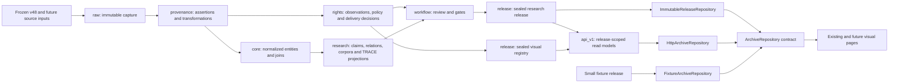

# v49 data platform architecture baseline

- Status: Phase 1C authority/research closure and Phase 1D rights/machine decisions integrated; joint pre-DDL verification pending
- Baseline date: 2026-08-11
- Recovered source commit: `0404c7f96f9189f576c4c5b1368061e4082e436b`
- Working branch: `refactor/v49-data-platform`

## Outcome

v49 separates canonical data, release artifacts, read APIs, repository adapters, and visual presentation. PostgreSQL is the future v49 canonical store; sealed releases are immutable read products; the frontend reads only an `ArchiveRepository` contract. The frozen v48 JSON, SQLite, TRACE shards, and receipts remain read-only evidence throughout migration and rollback.

This checkpoint establishes decisions and acceptance boundaries only. It does not create a database, migrate a row, generate a release, modify a visual page, run a full build, or change production behavior.

## Recovered v48 checkpoint

The recovered HEAD contains checkpoint `0404c7f` exactly. The commit preserves an interrupted visual analytics prototype with 77 changed files: 60 QA screenshots, one research report, and 16 frontend/script files. Its principal recovered content is:

| Area | Recovered content | Audit status |
|---|---|---|
| Code | Responsive shell and navigation changes; mobile Search layout; TRACE view switching; deterministic constellation geometry and verification assertions; large TRACE styling pass. | Completed as committed code; runtime unverified this round. |
| Mobile interaction | Guarded left-edge back swipe; icon-only menu/view controls; mobile atlas decade slider/playback/region selection; mobile object auto-selection; information/filter drawer; card-based Search results. | Implemented in code and represented by screenshots; gesture and accessibility behavior not replayed this round. |
| TRACE | Frozen atlas/catalog/shard reads, three views, active/review/auxiliary separation, real count-driven constellation geometry, and explicit no-influence wording. | Visual prototype completed; release integrity and repository decoupling only partial. |
| Search | Mobile filter disclosure and result cards, with archive index loaded only for a non-empty query. | Interaction code completed; index remains separately generated and release-unpinned. |
| QA evidence | 60 screenshot files across rounds 5–12, including desktop TRACE evidence and mobile atlas, constellation, object trace, region swipe, menu, and Search states. | Partial: only 50 unique Git blobs; 26 `.png` files have JPEG signatures; one before/after swipe pair is byte-identical; one mobile-labeled frame is 1280×720; there is no checkpoint-specific QA checksum matrix. Files were not recaptured or replayed this round. |
| Research | `MODERN_GRAPHIC_DESIGN_RESEARCH_AND_ARCHIVE_COMPARISON_V48.md` defines the evidence-bounded, rights-aware positioning, exact count vocabulary, bias limits, research questions, reproducibility route, and P0–P3 priorities. | Document completed; claims requiring expert audit or user research remain explicitly unproven. |

### Recovered limitations

The audit distinguishes these states:

- Completed: checkpoint identity, committed source and screenshots, frozen v48 receipts, real-count visual inputs, active/review/auxiliary separation in the frozen data.
- Partial: Search is a separate 8,636-item artifact without release/hash pinning; archive/TRACE/Search are not one atomic release; repository-level caching and schema validation do not exist; screenshot filenames alone do not establish distinct or correctly encoded QA states.
- Unverified: no browser, `next dev`, `next build`, full TypeScript, or interactive screenshot replay was run under this checkpoint's constraints.
- Explicit blockers: unknown relation labels currently fall back to `medium_context/documented`; frontend modules still import or fetch storage assets directly; the approximately 87 MiB public payload remains a binding UI contract; public metric-unit drift identified by the research report is unresolved; the legacy freeze auditor depends on omitted v47 intermediate data and cannot clean-room rerun 55 gates from `0404c7f` alone.

The v49 architecture treats those blockers as cutover gates, not as reasons to mutate v48.

## Non-negotiable invariants

1. Frozen v48 JSON, SQLite, manifests, shards, and receipts are never edited in place.
2. The frozen v48 JSON is the only migration input. SQLite is reconciliation-only; transfer/TRACE manifests are integrity evidence; Search and TRACE assets are derived products.
3. PostgreSQL becomes canonical for v49 only after reconciliation and promotion gates pass.
4. Raw artifact bytes and SHA-256 are lexical authority. JSONB is a parsed projection and cannot certify or replace those bytes.
5. Every normalized value keeps a link to the raw literal, source locator, transformation, and review decision when applicable.
6. Research data is addressed by exact `researchReleaseId + researchManifestSha256`; external visual delivery is addressed independently by the optional atomic pair `visualRegistryVersion + visualRegistrySha256`. No consumer silently mixes either pair, and registry absence never invalidates the research record.
7. Unknown relation types, rights ambiguity, schema mismatch, or hash mismatch fail closed.
8. Browser and UI code never import a database driver, raw provider payload, full canonical dump, manifest decoder, or shard decoder.
9. Visual components do not change in this architecture checkpoint.
10. A v48 seed object is an operational catalogued design object, not an unevidenced assertion of one unique intellectual work.
11. Evidence, claimant-bound claims, normalized semantic relations, and release/corpus-specific TRACE projections have separate identities and cardinalities.

## Target topology

Arrows represent governed derivation or reads. They do not imply reverse writes. `api_v1`, repository adapters, and visual pages cannot mutate canonical layers.

## Layer responsibilities

| Layer | Owns | Must not own |
|---|---|---|
| `raw` | Exact payload bytes/JSON, source artifact hash, capture event, original field literal. | Normalized truth, public display decision, inferred relation family. |
| `core` | FK-backed entity supertype/subtypes, stable objects, agents, places, concepts, collections, temporal extents, typed joins. | Provider payloads, review queues, UI formatting, unconstrained polymorphic IDs. |
| `provenance` | Source records, field assertions, evidence spans/URLs, citations, transformations, capture branches. | Final rights policy or mutable presentation state. |
| `rights` | External visual/provider identity, object-reference bridges, typed locator roles, rights observations/assessments, provider-policy versions/evaluations, delivery decisions, endpoint-health observations, attribution, review due and takedown evidence. | Object identity, research relation inference, arbitrary polymorphic targets, or treating technical access as authorization. |
| `research` | Claimants and epistemic claims, normalized semantic relations, versioned corpora/missingness, analysis runs, TRACE projections, folders and dossiers. | Unregistered relation fallback, ingestion state, UI state, or conflating projection with claim. |
| `workflow` | Import/review runs, queued/quarantined rows, decisions, gate receipts, promotion attempts, idempotency. | Public read models or sealed release bytes. |
| `release` | Independent immutable research releases and visual registries, copied projections, manifests, seal receipts, compatibility pins and CAS pointers. | Canonical editing, mutable `latest` content, or cross-pair fallback. |
| `api_v1` | Rights-safe, release-pinned read views/materializations and search documents. | Canonical writes, workflow commands, PostgreSQL-shaped DTOs. |

Detailed tables and field migrations are in `DATA_MODEL_V49.md`.

## Write path

1. Register an immutable source artifact in `raw.source_artifact` with bytes/hash/locator metadata.
2. Create a `workflow.import_run`; parse source records without deleting or overwriting literals.
3. Record field assertions, spans, evidence, and transformation version in `provenance`.
4. Resolve accepted entities and joins in `core`; rights observations/decisions in `rights`; and evidence-backed claims, semantic relations, corpora and projections in `research`.
5. Route ambiguity, unknown relations, authority conflicts, and rights uncertainty to `workflow` holds.
6. Run deterministic data gates against a stable database snapshot.
7. Materialize copied research-release and compatible visual-registry projections; `api_v1` composes only exact sealed pairs.
8. Generate and verify both candidate manifests/assets; reconcile against the v48 baseline and expected v49 deltas.
9. Seal the research release and visual registry independently. Each seal is append-only and separately receipted.

No step mutates a source artifact, sealed research release, or sealed visual registry.

## Phase 1A identity and Phase 1B semantic decisions

The normative identity/cardinality ledger is `docs/architecture/DDL_DECISION_PACK_V49.md`. Its locked decisions include:

- one deterministic seed `archive_object_id` per canonical v48 JSON `surfaceId`, without deduplication;
- `surface_id` as a durable public/legacy identifier mapped by FK-backed crosswalk, not the object PK;
- a closed `core.entity` supertype with exactly one matching subtype;
- typed bridges instead of `target_type + target_id`;
- separate assertions, canonical assignments, evidence, review cases, and curator decisions;
- directed TRACE projection and object/semantic-relation membership natural keys, with projection, semantic-relation, and claim identities kept distinct;
- publication layer, workflow state, acceptance state, epistemic class, rights assessment, provider-policy evaluation, delivery mode, endpoint health, takedown state, and metric-specific count eligibility as orthogonal axes.

Measured population boundaries are also normative: canonical JSON and active TRACE contain the same 15,923 IDs; legacy archive Search contains 8,636 IDs, with intersection 2,585, Search-only 6,051, and TRACE-only 13,338. Search-only derived rows are not migration input.

ADR 0004 is normative for Phase 1B: the Browse Index contains operational catalogued design objects; source/scholarly/computed/causal claims remain distinct; semantic relations are independent of TRACE nodes; strict research corpora are versioned selections with explicit missingness; and visual delivery uses an independent registry. Counts are classified as canonical parity, graph parity, derived reconciliation, or historical aspiration. The 20,000/4,077 planning value is historical only.

## Read path and `ArchiveRepository`

The frontend receives an async, release-bound repository. Its provider always resolves an exact research release and may resolve one exact compatible visual registry. A missing compatible registry is a normal research-only state: the research object remains usable and every visual locator is absent. An explicitly requested incompatible visual pair is a typed version-mismatch error and never falls back. Composed requests, cursors, cache keys, ETags and logs bind both exact pairs; research-only forms bind the exact research pair plus the explicit visual-unavailable reason.

Required repository capabilities are overview, folder types/folders/members, surface detail, Search, TRACE atlas/object/neighborhood, relation types, semantic relations, claims, and corpora. It owns runtime schema/compatibility validation, exact-pair cache keys, request deduplication, cancellation, pagination, rights-safe projection, and typed error mapping.

Three adapters implement the same contract:

- `HttpArchiveRepository` reads release-pinned `/api/v1` endpoints.
- `ImmutableReleaseRepository` validates both sealed manifests, compatibility, and their assets/shards.
- `FixtureArchiveRepository` reads a 10–50 object miniature research release plus visual registry for prototype tests.

There is no implicit fallback between adapters. Production refuses fixture mode. Details are normative in ADR 0003 and `READ_API_V1.md`.

## Unknown relation fail-closed

The current fallback that maps an unknown label to `medium_context/documented` is prohibited in v49.

1. `research.relation_type` is the only publishable registry.
2. An accepted semantic relation must reference a registered relation type with an enforced foreign key and qualifying claim/evidence support.
3. An unmapped raw label remains a proposed assertion in `raw`/`provenance` and creates a queued `workflow.relation_type_review_queue` case.
4. It creates no semantic relation, accepted claim, TRACE projection, invented family, publication-layer row, or metric-eligibility row, and appears in neither active TRACE nor `api_v1`.
5. The research-release gate requires zero active TRACE projections with unknown, inactive, evidence-incomplete, or family-mismatched types.
6. The manifest pins the relation-registry hash. A repository that sees a different or unknown type returns `INTEGRITY_FAILURE` for the resource; it does not render an `OTHER` relation.

Removing the current frontend fallback and proving these constraints is a future implementation task and a release blocker.

## Immutable research and visual boundaries

The research manifest covers Archive, Search, claims, semantic relations, corpora, TRACE projections, research registries and gate receipts. It records source lineage, database/migration/query-pack identities, exact counts, and every asset's schema, bytes, records, hash and partition.

The visual-registry manifest independently covers external visual references, object-reference bridges, providers and provider objects, typed visual locators, rights observations and assessments, provider-policy versions and evaluations, delivery decisions, endpoint-health observations, obligations and takedown state. It pins exactly one compatible research pair. Rights evidence, provider-policy evaluation, delivery decision, endpoint health and takedown are separate records. Delivery uses the closed modes `BLOCKED`, `CITATION_ONLY`, `LINK_ONLY`, `SOURCE_VIEWER` and `REMOTE_IMAGE`; only `REMOTE_IMAGE` may expose an allowlisted remote-pixel locator. A rights, health or takedown update creates a new visual-registry version or restrictive override; it never rewrites the research manifest.

Research shards carry their own `schemaVersion`, exact research identity/hash, resource kind, shard ID, deterministic partition, record count, records hash, and records; visual shards carry the exact visual identity/hash. Assets can reference only assets listed by their owning manifest. Cross-boundary references name both exact pairs and require declared compatibility. Missing or corrupt assets fail closed without cross-version fallback.

Both boundaries use `draft → candidate → validated → sealed`. Candidate closure fixes the copied projection and asset fingerprint; validated requires bound pre-seal receipts; canonical manifest bytes/SHA are committed atomically with seal. A detached post-seal sidecar makes the sealed pair pointer-eligible, and each `current` changes only by its own CAS. Candidate/sealed projections never join mutable canonical tables.

ADR 0002 is normative for release lifecycle and format.

## Data CI and frontend CI

The two pipelines are independent and exchange only immutable contracts.

### Data CI

Data CI owns migration linting, schema/constraint tests, import idempotency, raw hash checks, provenance completeness, claim/relation/corpus and rights/visual gates, reconciliation queries, deterministic projections, both manifest/shard verifiers, and data acceptance receipts. It may produce candidate research and visual versions. It does not run Next.js or visual regression tests.

### Frontend CI

Frontend CI pins a fixture or exact sealed research pair plus compatible visual-registry pair. It owns DTO/schema and non-disclosure checks, repository contract tests across adapters, cursor/error/loading-state tests, focused UI/unit tests, accessibility checks, and later visual regression. It does not connect to canonical PostgreSQL, run ingestion/export, or infer current data by filename.

### Promotion orchestration

A later release-candidate workflow may consume a passing data receipt and a passing frontend receipt. Only that later workflow may run the full production build and end-to-end browser suite. Data promotion never automatically deploys a frontend, and frontend deployment never rewrites data.

### Prototype prohibition

During the prototype stage, acceptance explicitly forbids full `next build`, full static route generation, `next dev`, browser automation, data export, and full-project TypeScript. Allowed checks are document/schema validation, fixture validation, repository contract tests, focused unit tests, and narrowly scoped type checks. This checkpoint uses document and read-only artifact checks only.

## Security and operational boundaries

- Seven roles are mandatory: NOLOGIN object `owner`, ephemeral `migrator`, `ingestor`, `reviewer`, `releaser`, `reader`, and read-only `auditor`.
- `api_v1` grants only `SELECT` to the runtime role; canonical schemas are not directly exposed.
- Application roles own no objects. Allowlisted append/decision/seal/CAS operations alone may use hardened `SECURITY DEFINER`; ordinary reads and audit queries are invoker-rights.
- Rights/provider policy is evaluated before visual-registry projection, then pinned by policy hash in that registry.
- Logs and telemetry always identify the exact research pair and identify the exact visual pair only when selected; research-only records carry the explicit visual state/reason. They also carry API contract version, request ID and error code, and never log restricted payloads.
- Backups and restore drills are required before PostgreSQL promotion.
- Rollback changes the pinned research and compatible visual descriptors or repository mode; it never edits either sealed boundary.

## Architecture completion boundary

The normative corpus is internally calibrated when the documents below use the same identity/layer/release/repository terms and preserve exact v48 evidence. Phase 1C closed the authority/count/research decision delta; Phase 1D closes the rights/visual/machine decision delta. Until the independent joint verifier passes, `ENGINEERING_PRE_DDL_READY`, `RESEARCH_SEMANTICS_PRE_DDL_READY`, `RIGHTS_VISUAL_PRE_DDL_READY`, `MACHINE_CONTRACT_PRE_DDL_READY`, and `OVERALL_PRE_DDL_READY` remain false. PostgreSQL, migration, freeze, frontend promotion and deployment remain unimplemented regardless of that later pre-DDL result.

## Normative documents

- `docs/adr/0001-canonical-postgres-and-read-only-release.md`
- `docs/adr/0002-immutable-data-versioning.md`
- `docs/adr/0003-runtime-repository-and-fixture-mode.md`
- `docs/adr/0004-research-claims-corpora-and-visual-registry.md`
- `docs/architecture/DDL_DECISION_PACK_V49.md`
- `DATA_MODEL_V49.md`
- `READ_API_V1.md`
- `MIGRATION_V48_TO_V49.md`
- `ACCEPTANCE_GATES.md`
