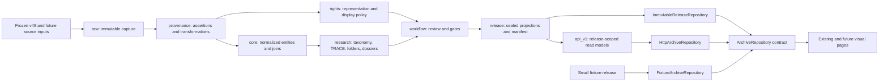

# v49 data platform architecture baseline

- Status: Architecture checkpoint; no migration or visual-page implementation
- Baseline date: 2026-08-10
- Recovered source commit: `0404c7f96f9189f576c4c5b1368061e4082e436b`
- Working branch: `refactor/v49-data-platform`

## Outcome

v49 separates canonical data, release artifacts, read APIs, repository adapters, and visual presentation. PostgreSQL is the future v49 canonical store; sealed releases are immutable read products; the frontend reads only an `ArchiveRepository` contract. The frozen v48 JSON, SQLite, TRACE shards, and receipts remain read-only evidence throughout migration and rollback.

This checkpoint establishes decisions and acceptance boundaries only. It does not create a database, migrate a row, generate a release, modify a visual page, run a full build, or change production behavior.

## Recovered v48 checkpoint

The recovered HEAD contains checkpoint `0404c7f` exactly. The commit preserves an interrupted visual analytics prototype with 77 changed files: 60 QA screenshots, one research report, and 16 frontend/script files. Its principal recovered content is:

| Area | Recovered content | Audit status |
|---|---|---|
| Code | Responsive shell and navigation changes; mobile Search layout; TRACE view switching; deterministic constellation geometry and verification assertions; large TRACE styling pass. | Completed as committed code; runtime unverified this round. |
| Mobile interaction | Guarded left-edge back swipe; icon-only menu/view controls; mobile atlas decade slider/playback/region selection; mobile object auto-selection; information/filter drawer; card-based Search results. | Implemented in code and represented by screenshots; gesture and accessibility behavior not replayed this round. |
| TRACE | Frozen atlas/catalog/shard reads, three views, active/review/auxiliary separation, real count-driven constellation geometry, and explicit no-influence wording. | Visual prototype completed; release integrity and repository decoupling only partial. |
| Search | Mobile filter disclosure and result cards, with archive index loaded only for a non-empty query. | Interaction code completed; index remains separately generated and release-unpinned. |
| QA evidence | 60 screenshot files across rounds 5–12, including desktop TRACE evidence and mobile atlas, constellation, object trace, region swipe, menu, and Search states. | Partial: only 50 unique Git blobs; 26 `.png` files have JPEG signatures; one before/after swipe pair is byte-identical; one mobile-labeled frame is 1280×720; there is no checkpoint-specific QA checksum matrix. Files were not recaptured or replayed this round. |
| Research | `MODERN_GRAPHIC_DESIGN_RESEARCH_AND_ARCHIVE_COMPARISON_V48.md` defines the evidence-bounded, rights-aware positioning, exact count vocabulary, bias limits, research questions, reproducibility route, and P0–P3 priorities. | Document completed; claims requiring expert audit or user research remain explicitly unproven. |

### Recovered limitations

The audit distinguishes these states:

- Completed: checkpoint identity, committed source and screenshots, frozen v48 receipts, real-count visual inputs, active/review/auxiliary separation in the frozen data.
- Partial: Search is a separate 8,636-item artifact without release/hash pinning; archive/TRACE/Search are not one atomic release; repository-level caching and schema validation do not exist; screenshot filenames alone do not establish distinct or correctly encoded QA states.
- Unverified: no browser, `next dev`, `next build`, full TypeScript, or interactive screenshot replay was run under this checkpoint's constraints.
- Explicit blockers: unknown relation labels currently fall back to `medium_context/documented`; frontend modules still import or fetch storage assets directly; the approximately 87 MiB public payload remains a binding UI contract; public metric-unit drift identified by the research report is unresolved; the legacy freeze auditor depends on omitted v47 intermediate data and cannot clean-room rerun 55 gates from `0404c7f` alone.

The v49 architecture treats those blockers as cutover gates, not as reasons to mutate v48.

## Non-negotiable invariants

1. Frozen v48 JSON, SQLite, manifests, shards, and receipts are never edited in place.
2. v48 canonical authority remains the frozen JSON; v48 SQLite remains a read-only query snapshot.
3. PostgreSQL becomes canonical for v49 only after reconciliation and promotion gates pass.
4. Every normalized value keeps a link to the raw literal, source locator, transformation, and review decision when applicable.
5. A release is addressed by exact `releaseId` and manifest SHA-256. No consumer silently mixes releases.
6. Unknown relation types, rights ambiguity, schema mismatch, or hash mismatch fail closed.
7. Browser and UI code never import a database driver, raw provider payload, full canonical dump, manifest decoder, or shard decoder.
8. Visual components do not change in this architecture checkpoint.

## Target topology

Arrows represent governed derivation or reads. They do not imply reverse writes. `api_v1`, repository adapters, and visual pages cannot mutate canonical layers.

## Layer responsibilities

| Layer | Owns | Must not own |
|---|---|---|
| `raw` | Exact payload bytes/JSON, source artifact hash, capture event, original field literal. | Normalized truth, public display decision, inferred relation family. |
| `core` | Stable objects, agents, places, concepts, collections, temporal extents, typed joins. | Provider payloads, review queues, UI formatting. |
| `provenance` | Source records, field assertions, evidence spans/URLs, citations, transformations, capture branches. | Final rights policy or mutable presentation state. |
| `rights` | Representations, rights statements, license/credit, access and display decisions with evidence. | Object identity, research relation inference. |
| `research` | Registered taxonomy, TRACE nodes/edges/trees, folder structures, dossiers, classifications. | Unregistered relation fallback, ingestion state, UI state. |
| `workflow` | Import/review runs, held rows, decisions, gate receipts, promotion attempts, idempotency. | Public read models or sealed release bytes. |
| `release` | Immutable release version, projection set, counts, assets, manifest and seal receipt. | Canonical editing or mutable `latest` content. |
| `api_v1` | Rights-safe, release-pinned read views/materializations and search documents. | Canonical writes, workflow commands, PostgreSQL-shaped DTOs. |

Detailed tables and field migrations are in `DATA_MODEL_V49.md`.

## Write path

1. Register an immutable source artifact in `raw.source_artifact` with bytes/hash/locator metadata.
2. Create a `workflow.import_run`; parse source records without deleting or overwriting literals.
3. Record field assertions, spans, evidence, and transformation version in `provenance`.
4. Resolve accepted entities and joins in `core`, rights in `rights`, and research structures in `research`.
5. Route ambiguity, unknown relations, authority conflicts, and rights uncertainty to `workflow` holds.
6. Run deterministic data gates against a stable database snapshot.
7. Materialize `api_v1` and `release` projections from accepted rows only.
8. Generate and verify a candidate manifest/assets; reconcile against the v48 baseline and expected v49 deltas.
9. Seal a new release. Sealing is append-only and separately receipted.

No step mutates the source artifact or a sealed prior release.

## Read path and `ArchiveRepository`

The frontend receives an async, release-bound repository. Its provider resolves either an exact release or `current`; after resolution every request uses the exact release ID and manifest hash.

Required repository capabilities are overview, folder types/folders/members, surface detail, Search, TRACE atlas/object/neighborhood, and relation type definitions. It owns runtime schema validation, release-keyed cache, request deduplication, cancellation, pagination, and typed error mapping.

Three adapters implement the same contract:

- `HttpArchiveRepository` reads release-pinned `/api/v1` endpoints.
- `ImmutableReleaseRepository` validates a sealed manifest and its assets/shards.
- `FixtureArchiveRepository` reads a 10–50 object miniature release for prototype tests.

There is no implicit fallback between adapters. Production refuses fixture mode. Details are normative in ADR 0003 and `READ_API_V1.md`.

## Unknown relation fail-closed

The current fallback that maps an unknown label to `medium_context/documented` is prohibited in v49.

1. `research.relation_type` is the only publishable registry.
2. A normalized edge must reference a registered relation type with an enforced foreign key.
3. An unmapped raw label remains in `raw`/`provenance` and creates `workflow.relation_type_review_queue` with `held` and `count_eligible=false`.
4. Held/unknown rows receive no invented family and appear in neither active TRACE nor `api_v1`.
5. The release gate requires zero active edges with unknown, inactive, evidence-incomplete, or family-mismatched types.
6. The manifest pins the relation-registry hash. A repository that sees a different or unknown type returns `INTEGRITY_FAILURE` for the resource; it does not render an `OTHER` relation.

Removing the current frontend fallback and proving these constraints is a future implementation task and a release blocker.

## Immutable release boundary

One canonical manifest covers Archive, Search, TRACE, rights-safe representations, registry snapshots, and gate receipts. It records source lineage, database/migration/query-pack identities, exact counts, and every asset's schema, bytes, records, hash, and partition.

Shards carry their own `schemaVersion`, exact `releaseId`, resource kind, shard ID, deterministic partition, record count, records hash, and records. Assets can reference only same-release assets listed by the manifest. Missing or corrupt assets fail closed without cross-release fallback.

ADR 0002 is normative for release lifecycle and format.

## Data CI and frontend CI

The two pipelines are independent and exchange only immutable contracts.

### Data CI

Data CI owns migration linting, schema/constraint tests, import idempotency, raw hash checks, provenance completeness, relation/rights gates, reconciliation queries, deterministic projections, manifest/shard verification, and a data acceptance receipt. It may produce a candidate data release. It does not run Next.js or visual regression tests.

### Frontend CI

Frontend CI pins a fixture or sealed release ID plus manifest hash. It owns DTO schema checks, repository contract tests across adapters, cursor/error/loading-state tests, focused UI/unit tests, accessibility checks, and later visual regression. It does not connect to canonical PostgreSQL, run ingestion/export, or infer current data by filename.

### Promotion orchestration

A later release-candidate workflow may consume a passing data receipt and a passing frontend receipt. Only that later workflow may run the full production build and end-to-end browser suite. Data promotion never automatically deploys a frontend, and frontend deployment never rewrites data.

### Prototype prohibition

During the prototype stage, acceptance explicitly forbids full `next build`, full static route generation, `next dev`, browser automation, data export, and full-project TypeScript. Allowed checks are document/schema validation, fixture validation, repository contract tests, focused unit tests, and narrowly scoped type checks. This checkpoint uses document and read-only artifact checks only.

## Security and operational boundaries

- PostgreSQL roles separate ingest, reviewer, releaser, API read-only, and migration privileges.
- `api_v1` grants only `SELECT` to the runtime role; canonical schemas are not directly exposed.
- Rights policy is evaluated before release projection, then pinned by policy hash.
- Logs and telemetry identify release ID, manifest hash, API contract version, request ID, and error code; they do not log restricted payloads.
- Backups and restore drills are required before PostgreSQL promotion.
- Rollback changes the pinned release descriptor or repository mode; it never edits a sealed release.

## Architecture completion boundary

This baseline is complete when all eight requested documents exist, cross-reference consistent layer/release/repository terms, carry the exact v48 acceptance baseline, and are committed locally without forbidden processes. The data platform itself remains partial until migration, adapters, releases, CI, and cutover gates are implemented.

## Normative documents

- `docs/adr/0001-canonical-postgres-and-read-only-release.md`
- `docs/adr/0002-immutable-data-versioning.md`
- `docs/adr/0003-runtime-repository-and-fixture-mode.md`
- `DATA_MODEL_V49.md`
- `READ_API_V1.md`
- `MIGRATION_V48_TO_V49.md`
- `ACCEPTANCE_GATES.md`
