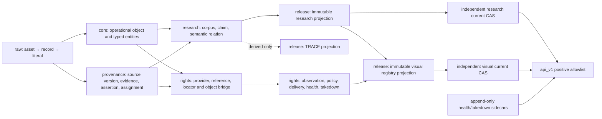

# v49 physical schema map

## Domain flow

## Constraint strategy

- Canonical IDs are UUID primary keys; generated public URNs are deterministic.
- Every polymorphic family uses a closed enum parent plus exact-one subtype
  tables with real foreign keys.
- Canonical/evidence parent deletion is `RESTRICT`; governed histories are
  append-only and supersession must preserve the typed parent identity.
- Natural keys cover legacy identity, source occurrence/fingerprint,
  subject-predicate-object state, corpus/release membership, provider/locator
  identity, evidence bridges and current-pointer channels.
- Accepted assertions, claims and semantic relations use deferred validation,
  allowing incomplete draft transactions but rejecting incomplete committed
  state. Unknown or inactive predicates cannot be accepted.
- A relation is accepted only with an active registered type and an accepted
  evidence-bearing supporting claim or an evidence-bearing effective curator
  decision. `legacy_projection_only` is never accepted.
- TRACE edges are copied under one release and corpus version, use composite
  foreign keys to copied nodes and relations, and carry a deterministic
  generation key. Zero copied relations and zero TRACE edges are legal.
- Visual delivery has independent rights evidence, provider-policy evaluation,
  delivery decision, endpoint-health and takedown axes. Locator-to-digital-
  representation identity is explicit, preventing sibling-rights inheritance.
- `REMOTE_IMAGE` requires a current permitted evidence chain, a current
  evidence-backed remote-display policy, complete evidence-backed ordered
  attribution, and a matching bounded `healthy_fresh` direct-image locator.
- Release fingerprints and manifests use the restricted RFC 8785 encoder in
  `release.jcs_bytes`: fixed object keys, arrays, strings, booleans, null and
  IEEE-754-safe integers. Arbitrary-precision analysis scores, uncertainty and
  thresholds are committed as normalized finite decimal strings. Timestamps
  are committed as UTC epoch microseconds, avoiding delimiter, locale,
  floating-point and timezone drift.

## Release and audit objects

Research and visual candidates copy the exact approved row set. Validation
recomputes fingerprints and checks every copied identity against its canonical
source. Each boundary has an approved, closed validation profile; every typed
required PASS receipt must be present, canonical, immutable and bound to the
candidate fingerprint before validation and sealing can proceed. Seal creates
RFC 8785 manifest bytes and SHA-256 in the same SERIALIZABLE transaction.
Independent reviewers append detached verification sidecars before current
promotion is eligible.

CAS functions lock the pointer row, compare generation plus the complete
expected ID/hash pair with `IS DISTINCT FROM`, verify a sealed target, and
append both the success/failure attempt and public promotion history. Research
and visual pointers never update one another. Visual CAS additionally locks and
checks the guarded research pointer and exact compatibility pair.

Audit tables are append-only and have typed subtypes for research decisions,
rights/policy/delivery/takedown decisions, release transitions, seals, CAS
attempts, verification receipts and post-seal sidecars.

## Deliberately deferred physical features

Partitioning, PostGIS, graph databases, broad GIN indexes, full-text search,
materialized visualization tables and workload-specific denormalization remain
deferred until populated migration metrics and real query plans exist.
