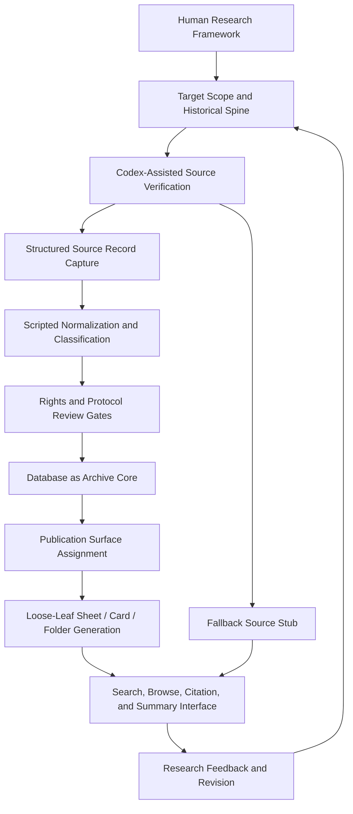

# Automated Archive Workflow v0

This document defines the project's core production logic.

The project is not only a public-facing archive index. It is also a modern automated archive workflow: a research framework where human conceptual structure, machine-assisted source verification, scripted normalization, database storage, rights-aware rendering, and public archive sheets form one reproducible system.

## Core Premise

The researcher provides the historical and methodological framework.

Codex and scripts perform large-scale mechanical work:

- source lookup;
- link verification;
- terms and rights checking;
- metadata extraction;
- deterministic classification;
- database insertion;
- validation;
- sheet generation;
- public index preparation.

The database then becomes the center of truth from which public archive surfaces are generated.

The final website is therefore not a hand-designed set of pages. It is an archive interface produced from structured records, rights decisions, citations, classifications, and templates.

## Workflow Summary

## Human Role

The human researcher is responsible for:

- defining the historical framework;
- deciding the research questions;
- setting the ethical and rights boundaries;
- judging whether a movement, source, relation, or classification is meaningful;
- reviewing ambiguous cases;
- writing the final humanities research argument after the system has produced evidence.

The human is not expected to manually click, copy, and classify every source one by one.

## Codex Role

Codex is responsible for mechanical and semi-mechanical research labor:

- reading project reports and source documents;
- checking whether links resolve;
- identifying whether a record is exact, search-path-only, or blocked;
- extracting visible metadata fields;
- flagging missing citation, rights, language, date, or authority fields;
- proposing source replacements when a stronger record exists;
- creating verification tables;
- updating database skeletons, contracts, and scripts;
- validating whether generated data remains searchable and reproducible.

Codex does not create historical evidence. It organizes, checks, and prepares evidence for review.

## Script Role

Scripts are responsible for repeatable transformation:

1. Read target lists and source records.
2. Fetch only from approved access modes.
3. Store raw source fields.
4. Normalize fields into local schema.
5. Attach citations and access dates.
6. Apply rights gates.
7. Assign historical nodes, movements, regions, media, themes, and record families.
8. Generate database rows.
9. Validate row counts, required fields, and publication eligibility.
10. Export publication surfaces.

Scripts must never decide image display by raw image URL alone.

## Fallback Logic

If a target cannot be safely fetched, confirmed, or ingested, the system should not erase the historical area.

Instead, it creates a fallback source stub.

A fallback source stub is not a source record. It is a structured statement that a historically relevant target or source path exists, but the project has not absorbed it into the archive database as evidence.

Fallback stubs preserve:

- historical scope cell;
- target label;
- source name;
- source URL or deterministic search path;
- canonical URL if available;
- replacement URL if a better source is recommended;
- verification decision;
- blocking reason;
- required next action;
- expected image state.

Public behavior:

- exact but unconfirmed records render as link-only stubs;
- search-path-only records render as search-path stubs;
- rights/access-blocked image records render as `IMG00` empty-frame records;
- text/authority cases that cannot be captured render as `IMG04` text stubs;
- replacements point users to the replacement source but do not silently rewrite the original target.

This keeps the archive honest: a missing or blocked source remains visible as a research state, not as a failed record and not as invisible absence.

## Database Role

The database is the archive core.

It stores:

- source records;
- normalized entities;
- field provenance;
- citations;
- rights reviews;
- source terms reviews;
- digital representations;
- classifications;
- relations;
- record-family profiles;
- validation rules;
- publication surfaces;
- folder memberships;
- searchable documents.

The database is not merely a backend for the website. It is the reproducible archive structure from which the website is generated.

## Publication Surface Role

Public archive pages are generated from database state.

The system converts records into:

- sheets;
- cards;
- index appendices;
- folder covers;
- registration cards;
- bookmarks;
- excerpt strips.

Each surface is assigned:

- global `SEQ`;
- display number;
- sheet/card type;
- tier;
- layout ID;
- page number;
- image state;
- six standard table rows;
- rights stamp;
- citation and source-return actions.

This means the interface is not manually composed for each record. It is a rules-based archive paper system.

## Rights-Aware Image Logic

Image behavior is resolved by rights and page type:

- `IMG00`: image frame exists but no image is displayed.
- `IMG01`: permitted thumbnail.
- `IMG02`: permitted source-hosted viewer/embed/IIIF.
- `IMG03`: open/reusable image with license and credit.
- `IMG04`: no image frame; text/authority/event/appendix page.

Image size and page layout are separate from image state.

The system must default to `IMG00` unless evidence supports an upgrade.

## Integrity and Reproducibility

Every public record must be traceable back to:

- original source URL or locator;
- access date;
- raw source fields;
- normalized fields;
- field provenance;
- citation;
- rights evidence;
- classification basis;
- workflow status.

Uncertainty is not removed. It is stored as data.

Failed capture, blocked access, search-only paths, and source replacement decisions are also stored as data through ingestion events and fallback source stubs.

## Why This Matters

The project is a modern automated archive form because it treats archive construction itself as a research method.

It does not simply display collected materials. It builds a repeatable system for discovering, verifying, classifying, citing, and rendering distributed graphic design history materials without claiming ownership of them.

The archive grows through controlled loops:

1. framework;
2. source verification;
3. structured capture;
4. normalization;
5. rights review;
6. database update;
7. generated archive surface;
8. public search and reading;
9. research feedback.

This allows the project to remain broad, rights-aware, and historically revisable without becoming either a static textbook or an image-hoarding collection.

## Current Implementation Boundary

The project is currently between steps 2 and 4:

- the global framework exists;
- the first 48 targets exist;
- a first verification pass exists;
- database skeletons exist;
- publication surface skeletons exist;
- source and rights review models exist.
- fallback source stubs now exist for targets that cannot yet become source records.

The next practical step is to turn the verified subset of first targets into structured manual source records, then write ingest scripts that can transform those records into database rows and generated archive sheets.
